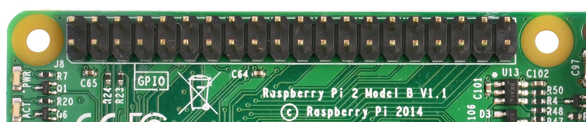

# S0 Interface Module
Protocol: PWM based, 2-Wire S0 Interface

#### S0 Interface
https://de.wikipedia.org/wiki/S0-Schnittstelle  
The S0 interface is a hardware interface for the transmission of consumption measurements in building automation. The definition of the interface is given in EN 62053-31. While standard signals are suitable for values ​​such as current, voltage, temperature or power, meter readings are transmitted by means of pulses.  

The output is technically an open collector of a transistor connected downstream of an optocoupler . When connecting the interface, you must therefore pay attention to the polarity.  

## Pin Connections (RPi)

 
 
 
| S0 Interface | RPi  |
|--------------|------|
| S0+ wire     | GPIO 3 (wired pull-up)  |
| S0- wire     | GND PIN |

## Bibliography
-   https://de.wikipedia.org/wiki/S0-Schnittstelle
-   http://www.skrue.de/wp/?p=41
-   https://blog.webernetz.net/stromzahler-mit-s0-schnittstelle-vom-raspberry-pi-auswerten/