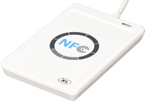

# ACS ACR122U SmartCard/NFC Reader Example

This example shows the installation procedure of the ACR122U Reader and a 
small Java example to read out the ID of a Smartcard or an NFC tag. 
The reader must be connected via USB to a PC. The software is tested for 
Windows 10 only.  

## Hardware

ACS ACR122U SmartCard/NFC Reader
- USB interface
- Supported card types
    - MIFARE
    - ISO 14443 A/ B
    - NFC
    - FeliCa

## Installation Procedure
1. Install the driver from /nfc/driver if not installed automatically from windows
2. Create Java-project and import source code from [java/MainApp.java](./java/MainApp.java).

## Reference Manual
1. [ACR122U NFC Reader API.pdf](./info/ACR122U NFC Reader API.pdf)
2. [ACR122U NFC Reader P2P Demo Manual.pdf](.info/ACR122U NFC Reader P2P Demo Manual.pdf)
3. [ACR122U NFC Reader SDK User Manual.pdf](.info/ACR122U NFC Reader SDK User Manual.pdf)
4. [ACR122U NFC Reader Technical Specification.pdf](.info/ACR122U NFC Reader Technical Specification.pdf)
5. [ACR122U NFC Reader VMS Demo Manual.pdf](.info/ACR122U NFC Reader VMS Demo Manual.pdf)
6. [Mifare 1K-m001051-MF1S50.pdf](.info/Mifare 1K-m001051-MF1S50.pdf)
7. [Mifare 4K-m043531-MF1S70.pdf](.info/Mifare 4K-m043531-MF1S70.pdf)
8. [Mifare Ultralight-M028630-MF0U10.pdf](.info/Mifare Ultralight-M028630-MF0U10.pdf)
9. [Topaz-M2000-1057-02.pdf](.info/Topaz-M2000-1057-02.pdf)

## Bibliography
- https://docs.oracle.com/javase/6/docs/jre/api/security/smartcardio/spec/javax/smartcardio/package-summary.html
- https://ludovicrousseau.blogspot.com/2010/06/pcsc-sample-in-java.html
- https://stackoverflow.com/questions/21972603/get-uid-of-mifare-ultralight-with-scl010